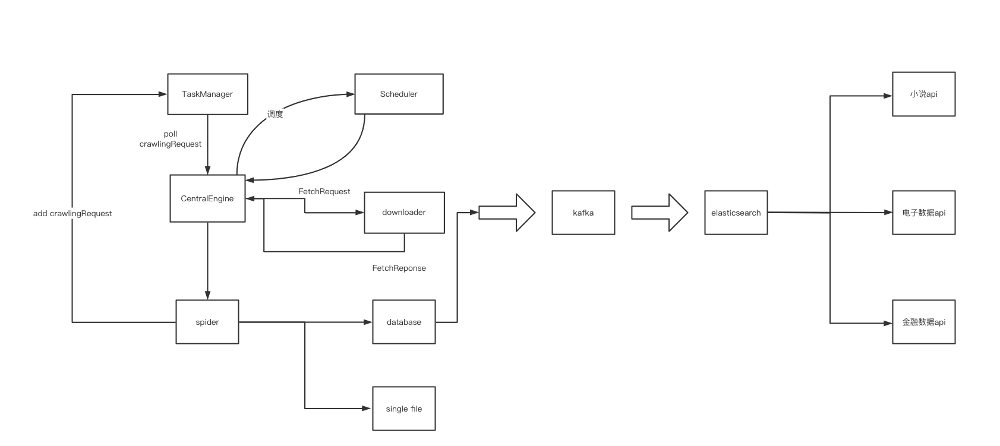

# ja-spider
仿照scrapy做一个java版本的爬虫框架。


## 学习到的知识
- java泛型知识。
- spring监听模式。
```
多播器是怎么精准的将事件推送到相关的listener的，原来是经过筛选的。
筛选出相应的事件类型监听器，然后消除warning。学到了。
```


## 整体架构图



#### 碰到的问题记录
- 泛型方法什么时候用<?>，什么时候用具体的泛型类。
```
看这个方法能不能在运行阶段能不能够处理多个泛型类。
void function(泛型类<?> parm);
这个方法就能同时处理泛型类<A>,泛型类<B>。

void function(泛型类<A> parm);
这个方法就只能处理泛型类<A>。
```
- 爬取非固定位置的'下一页'问题
```
网站中的下一页不是一个固定位置，
要经过计算才能确定下一页具体在哪一个位置。
```
- 去重复问题
```
考虑运用缓存机制。
- 提供内存数据库做缓存。
- 用redis来做缓存。
如果用redis，那么就涉及到初始化redis数据的问题。
```

- 爬到一半中断了该怎么办？？


- ResolvableType的学习
就是说你如果实现了ResolvableTypeProvider，那么更加精确的东西就会反给你。
否则就使用forClass。

原代码中还加了各种缓存去筛选listener。